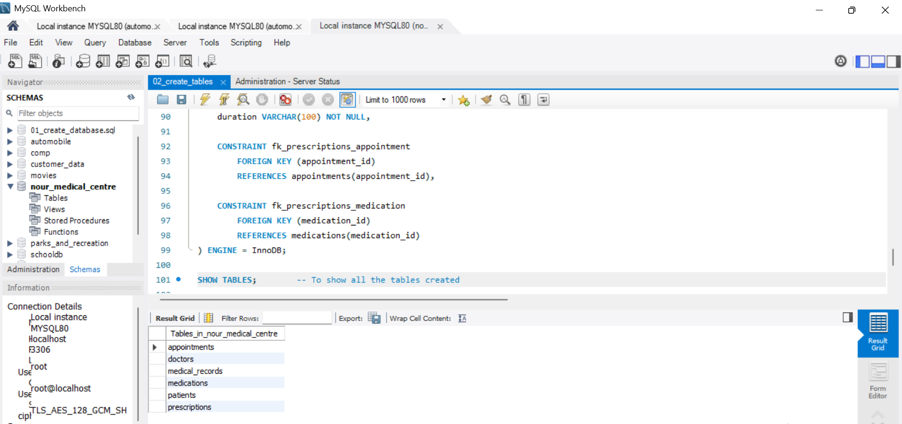
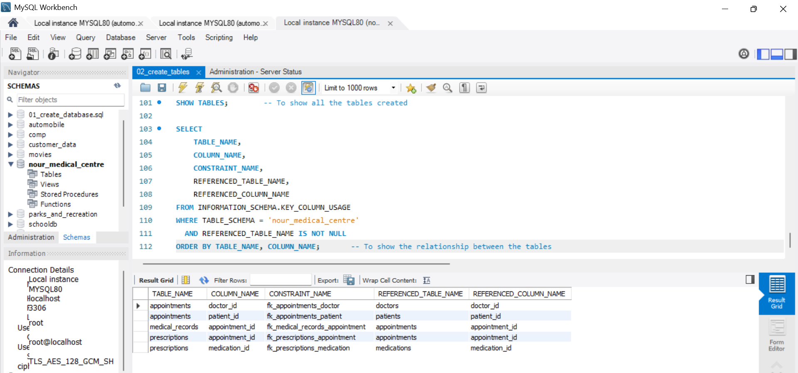

# Relational Database Design for Nour Medical Centre


## 📌 Project Overview

Nour Medical Centre is a small medical facility that requires a structured database to manage its day-to-day clinical operations.

This project involves the **design and implementation of a relational database using MySQL** to manage patients, doctors, appointments, diagnoses, medications, and prescriptions.

The database was developed using a **requirements-driven approach**, applying core relational database principles including entity-relationship modeling, normalization, primary and foreign keys, referential integrity, data consistency, and transaction reliability.

The project follows a complete database design process:

> **Business Requirements → Entity Identification → Relational Schema → Normalization → Implementation → Evaluation → Refinement**

---

## 🎯 Project Objectives

The objectives of this project are to:

- Translate business requirements into a structured relational database model.
- Identify the entities, attributes, and relationships required by the medical centre.
- Design a normalized schema that minimizes unnecessary data redundancy.
- Establish appropriate primary and foreign key relationships.
- Implement the database using MySQL.
- Apply constraints to maintain data integrity and consistency.
- Evaluate the schema against core relational database principles.
- Identify design limitations and refine the schema where appropriate.
- Demonstrate practical application of SQL and relational database design.
- Design a database structure that can support future operational and analytical requirements.

---

## 🏥 Business Requirements

The database is based on the following requirements.

### Patients

Each patient has:

- A unique patient ID
- Full name
- Date of birth
- Contact number

### Doctors

Each doctor has:

- A unique doctor ID
- Name
- Specialisation

### Appointments

Patients can book appointments with specific doctors.

Each appointment records:

- Patient
- Doctor
- Date and time
- Reason for visit

### Medical Records

After an appointment, the doctor records:

- Diagnosis
- Any prescribed medication

A patient can have many appointments, while a doctor can see many patients.

---

# 🧩 Database Entities

The business requirements were translated into six core entities:

| Entity | Purpose |
|---|---|
| **Patients** | Stores patient demographic and contact information. |
| **Doctors** | Stores information about doctors and their specialisations. |
| **Appointments** | Records appointments between patients and doctors. |
| **Medical Records** | Stores diagnoses associated with appointments. |
| **Medications** | Maintains a structured list of medications. |
| **Prescriptions** | Links medications to appointments and stores prescription details. |

---

# 🔗 Entity Relationships

The database uses the following relationships:

```
                         ┌──────────────────┐
                         │     PATIENTS     │
                         └────────┬─────────┘
                                  │
                                 1:M
                                  │
                         ┌────────▼─────────┐
                         │   APPOINTMENTS   │
                         └───┬──────────┬───┘
                             │          │
                            1:1        1:M
                             │          │
              ┌──────────────▼──┐   ┌───▼─────────────┐
              │ MEDICAL RECORDS │   │  PRESCRIPTIONS  │
              └─────────────────┘   └───────┬─────────┘
                                             │
                                            M:1
                                             │
                                    ┌────────▼────────┐
                                    │   MEDICATIONS   │
                                    └─────────────────┘

                         ┌──────────────────┐
                         │      DOCTORS     │
                         └────────┬─────────┘
                                  │
                                 1:M
                                  │
                           APPOINTMENTS

````
### Cardinality

* **Patients → Appointments:** One-to-Many (1:M)
* **Doctors → Appointments:** One-to-Many (1:M)
* **Appointments → Medical Records:** One-to-One (1:1)
* **Appointments → Prescriptions:** One-to-Many (1:M)
* **Medications → Prescriptions:** One-to-Many (1:M)

The `Appointments` table resolves the many-to-many relationship between patients and doctors.

The `Prescriptions` table resolves the many-to-many relationship between appointments and medications.

---

# 🗃️ Relational Schema

## 1. Patients

Stores demographic and contact information for patients registered at the medical centre.

| Field            | Data Type    | Key / Constraint   |
| ---------------- | ------------ | ------------------ |
| `patient_id`     | INT          | PK, AUTO_INCREMENT |
| `full_name`      | VARCHAR(100) | NOT NULL           |
| `date_of_birth`  | DATE         | NOT NULL           |
| `contact_number` | VARCHAR(20)  | NOT NULL           |

**Primary Key:** `patient_id`

---

## 2. Doctors

Stores information about doctors employed by the medical centre.

| Field            | Data Type    | Key / Constraint   |
| ---------------- | ------------ | ------------------ |
| `doctor_id`      | INT          | PK, AUTO_INCREMENT |
| `doctor_name`    | VARCHAR(100) | NOT NULL           |
| `specialisation` | VARCHAR(100) | NOT NULL           |

**Primary Key:** `doctor_id`

---

## 3. Appointments

Records appointments between patients and doctors.

| Field                  | Data Type    | Key / Constraint   |
| ---------------------- | ------------ | ------------------ |
| `appointment_id`       | INT          | PK, AUTO_INCREMENT |
| `patient_id`           | INT          | FK, NOT NULL       |
| `doctor_id`            | INT          | FK, NOT NULL       |
| `appointment_datetime` | DATETIME     | NOT NULL           |
| `reason`               | VARCHAR(255) | NOT NULL           |

**Primary Key:** `appointment_id`

**Foreign Keys:**

```text
patient_id → patients.patient_id
doctor_id  → doctors.doctor_id
```

---

## 4. Medical Records

Stores the diagnosis resulting from an appointment.

| Field               | Data Type | Key / Constraint     |
| ------------------- | --------- | -------------------- |
| `medical_record_id` | INT       | PK, AUTO_INCREMENT   |
| `appointment_id`    | INT       | FK, UNIQUE, NOT NULL |
| `diagnosis`         | TEXT      | NOT NULL             |

**Primary Key:** `medical_record_id`

**Foreign Key:**

```text
appointment_id → appointments.appointment_id
```

The `UNIQUE` constraint on `appointment_id` ensures that an appointment can have only one medical record in the current design.

---

## 5. Medications

Stores a structured list of medications that can be prescribed.

| Field             | Data Type    | Key / Constraint   |
| ----------------- | ------------ | ------------------ |
| `medication_id`   | INT          | PK, AUTO_INCREMENT |
| `medication_name` | VARCHAR(100) | NOT NULL, UNIQUE   |

**Primary Key:** `medication_id`

The `UNIQUE` constraint prevents duplicate medication names from being unnecessarily stored.

---

## 6. Prescriptions

Links medications to appointments and stores medication-specific prescription information.

| Field             | Data Type    | Key / Constraint   |
| ----------------- | ------------ | ------------------ |
| `prescription_id` | INT          | PK, AUTO_INCREMENT |
| `appointment_id`  | INT          | FK, NOT NULL       |
| `medication_id`   | INT          | FK, NOT NULL       |
| `dosage`          | VARCHAR(100) | NOT NULL           |
| `frequency`       | VARCHAR(100) | NOT NULL           |
| `duration`        | VARCHAR(100) | NOT NULL           |

**Primary Key:** `prescription_id`

**Foreign Keys:**

```text
appointment_id → appointments.appointment_id
medication_id  → medications.medication_id
```

This structure allows a single appointment to have multiple prescribed medications.

---

# 🔑 Keys and Relationships

The database uses primary and foreign keys to establish relationships and maintain referential integrity.

### Primary Keys

```text
patients.patient_id
doctors.doctor_id
appointments.appointment_id
medical_records.medical_record_id
medications.medication_id
prescriptions.prescription_id
```

### Foreign Keys

```text
appointments.patient_id
        ↓
patients.patient_id
```

```text
appointments.doctor_id
        ↓
doctors.doctor_id
```

```text
medical_records.appointment_id
        ↓
appointments.appointment_id
```

```text
prescriptions.appointment_id
        ↓
appointments.appointment_id
```

```text
prescriptions.medication_id
        ↓
medications.medication_id
```


---

# 🧠 Key Design Decision: Structured Prescription Management

The initial design stored prescribed medication as a text field within the medical record.

This was identified as a potential limitation because a patient may receive multiple medications from a single appointment.

For example:

```text
Paracetamol 500mg twice daily for 5 days
Amoxicillin 500mg three times daily for 7 days
```

Storing this information as one text value would make it difficult to:

* Query individual medications.
* Track medication usage.
* Store medication-specific dosage and frequency.
* Analyze prescribing patterns.
* Maintain consistent medication names.
* Scale the database for future prescription requirements.

### Refinement

The initial `prescribed_medication` attribute was therefore replaced with two related entities:

```text
MEDICATIONS
    │
    │ 1:M
    ▼
PRESCRIPTIONS
    │
    │ M:1
    ▼
APPOINTMENTS
```

This allows:

* Multiple medications per appointment.
* Structured medication names.
* Medication-specific dosage.
* Medication-specific frequency.
* Treatment duration.
* Improved querying and reporting.
* Reduced data redundancy.

This refinement was implemented because it provides a more scalable and relational representation of prescription data while still satisfying the original business requirement.

---

# 🧱 Normalization

The schema was evaluated against the first three normal forms.

## First Normal Form (1NF)

The design uses atomic attributes and avoids repeating groups.

For example, medications are no longer stored as a comma-separated or free-text list. Instead, each medication associated with an appointment is represented as a separate prescription record.

---

## Second Normal Form (2NF)

Non-key attributes are dependent on the primary key of their respective entity.

For example:

* Patient details depend on `patient_id`.
* Doctor details depend on `doctor_id`.
* Appointment details depend on `appointment_id`.
* Medication details depend on `medication_id`.
* Prescription details depend on `prescription_id`.

---

## Third Normal Form (3NF)

Non-key attributes depend on the primary key and not on other non-key attributes.

For example, a doctor's specialisation is stored in the `Doctors` table rather than repeatedly storing it in every appointment involving that doctor.

Similarly, the medication name is stored in `Medications` rather than repeatedly storing the same medication name in `Prescriptions`.

This separation reduces unnecessary redundancy and improves consistency.

---

# 🛡️ Data Integrity

The schema uses several constraints to maintain data quality and integrity.

### Primary Keys

Ensure that every row has a unique identifier.

### Foreign Keys

Ensure that relationships between entities reference valid records.

### NOT NULL Constraints

Ensure that required fields cannot be left empty.

### UNIQUE Constraints

Prevent duplicate values where uniqueness is required.

Examples include:

```text
medications.medication_name
medical_records.appointment_id
```

These constraints help prevent invalid or inconsistent data from entering the database.

---

# 💾 Persistence and ACID

The database is implemented using **MySQL** with the **InnoDB** storage engine.

Data is stored persistently rather than in temporary or volatile in-memory structures.

InnoDB provides transactional support based on the ACID principles:

### Atomicity

A transaction is treated as a single unit. Operations can either all succeed or be rolled back.

### Consistency

Database constraints help ensure that transactions do not leave the database in an invalid state.

### Isolation

Concurrent transactions are managed according to the configured MySQL transaction isolation level.

### Durability

Once a transaction is committed, the database engine persists the changes.

For example, creating an appointment and recording its related clinical information can be handled within a transaction.

```sql
START TRANSACTION;

-- Create appointment
-- Record medical information
-- Create prescription records

COMMIT;
```

If an error occurs:

```sql
ROLLBACK;
```

This prevents a partially completed transaction from being committed.

---

# 🔄 CRUD Operations

All six core tables support standard CRUD operations.

| Table           | Create | Read | Update | Delete |
| --------------- | :----: | :--: | :----: | :----: |
| Patients        |    ✓   |   ✓  |    ✓   |    ✓   |
| Doctors         |    ✓   |   ✓  |    ✓   |    ✓   |
| Appointments    |    ✓   |   ✓  |    ✓   |    ✓   |
| Medical Records |    ✓   |   ✓  |    ✓   |    ✓   |
| Medications     |    ✓   |   ✓  |    ✓   |    ✓   |
| Prescriptions   |    ✓   |   ✓  |    ✓   |    ✓   |

Examples include:

* Registering a new patient.
* Adding a doctor.
* Booking an appointment.
* Updating patient information.
* Recording a diagnosis.
* Adding a medication.
* Creating a prescription.
* Retrieving a patient's medical history.

In a production healthcare environment, deletion of clinical records would require appropriate retention and governance policies rather than unrestricted hard deletion.

---

# 📊 Business Queries

## Business Questions & Analytical Objectives

Beyond storing and managing clinic records, the database is designed to support operational analysis and answer practical business questions. The SQL analysis explores the following areas:

### Patient Analysis
- How many patients are registered with the medical centre?
- What is the age distribution of the patient population?
- How frequently do patients return for appointments?

### Appointment & Operational Analysis
- How many appointments have been recorded?
- How does appointment demand vary by month?
- Which days of the week experience the highest appointment volume?
- What times of day are busiest?

### Doctor & Specialisation Analysis
- How many appointments does each doctor handle?
- How is workload distributed across doctors?
- Which medical specialisations experience the highest demand?
- How many doctors are available within each specialisation?

### Clinical Analysis
- What are the most frequently recorded diagnoses?
- Which medications are prescribed most frequently?
- How many prescriptions are typically associated with an appointment?

### Patient Engagement
- How many patients have multiple appointments?
- Which patients have the highest number of recorded visits?
- What does the distribution of patient visit frequency look like?

---

# 🔍 Design Evaluation & Refinement

After the initial schema was developed, it was evaluated against:

* Relational database principles
* Entity-relationship modeling
* Normalization
* Primary and foreign key integrity
* Data redundancy
* Referential integrity
* CRUD requirements
* Persistence
* ACID transaction principles
* Scalability
* Future operational requirements

The evaluation identified an issue with storing prescribed medication as a single text attribute.

Rather than retaining a potentially difficult-to-query text field, the design was refined by introducing the `Medications` and `Prescriptions` entities.

This refinement improved the normalization, scalability, and analytical capability of the database while preserving all relationships required by the original business scenario.

📄 **Detailed documentation:**
[Database Design & Refinement](documentation/database-design-and-refinement.md)

---

# 🚀 Future Enhancements

Although the current schema satisfies the stated requirements, several enhancements could be considered if Nour Medical Centre expands its operations.

## 1. Appointment Status

Add an `appointment_status` field to distinguish between:

* Scheduled
* Completed
* Cancelled
* No-show

This would improve appointment tracking and operational reporting.

---

## 2. Audit Timestamps

Add:

```text
created_at
updated_at
```

These fields would improve:

* Data traceability
* Auditing
* Change tracking
* Data governance

---

## 3. Payment Management

A dedicated `Payments` entity could be introduced to support:

* Billing
* Payment tracking
* Outstanding balances
* Revenue reporting
* Payment method analysis

---

## 4. Laboratory Management

A future laboratory module could introduce entities for:

* Laboratory tests
* Test orders
* Results
* Test status
* Test history

This would allow the database to support broader clinical workflows.

---

## 5. Staff and Department Management

As the medical centre grows, additional entities could be introduced to manage:

* Nurses
* Administrative staff
* Departments
* Roles
* Staff assignments

These enhancements are outside the scope of the current requirements and would only be implemented if supported by future business needs.

---

# 🧭 Design Philosophy

The database was developed using a **requirements-driven approach**.

Rather than introducing unnecessary entities or attributes, the initial schema was designed to satisfy the stated business requirements while maintaining core relational database principles.

The schema was then evaluated for:

* Data redundancy
* Normalization
* Referential integrity
* Scalability
* Queryability
* Transaction reliability

Where a limitation was identified, the design was refined based on the underlying business requirement.

The prescription model is an example of this approach: instead of storing multiple medications as unstructured text, the information was normalized into `Medications` and `Prescriptions`.

This approach balances:

> **Simplicity + Data Integrity + Scalability + Analytical Usability**

---

# 🛠️ Technology

* **Database:** MySQL
* **Language:** SQL
* **Database Model:** Relational
* **Storage Engine:** InnoDB
* **Design Approach:** Requirements-driven relational database design

---

# 📂 Project Structure

```text
Relational-Database-Design-for-Nour-Medical-Centre/
│
├── README.md
│
├── database/
│   ├── 01_create_database.sql
│   ├── 02_create_tables.sql
│   ├── 03_insert_sample_data.sql
│   └── 04_business_queries.sql
│
├── documentation/
│   ├── database-design-and-refinement.md
│   └── ERD.png
│
└── screenshots/
    └── mysql-workbench.png
```

---

# 💡 Key Learning Outcomes

This project demonstrates practical experience in:

* Requirements analysis
* Relational database design
* Entity identification
* Relationship and cardinality analysis
* Entity-Relationship Modeling
* Database normalization
* Primary and foreign key implementation
* Referential integrity
* SQL database implementation
* CRUD operations
* Multi-table queries and JOINs
* Transaction management
* Data integrity
* Database evaluation and refinement
* Structured prescription modeling
* Designing for scalability
* Translating business requirements into technical solutions

---

## 👤 Author

**Chidiebere David Ogbonna**

Data Analyst | SQL | Power BI | Tableau | Python | Excel

## Contact

Feel free to send your reviews, suggestions, questions and collaboration requests to chidieberedavid326@gmail.com

| Detail | Link |
| ------ | ---- |
| Email | chidieberedavid326@gmail.com |
| LinkedIn | [chidieberedavidogbonna](https://www.linkedin.com/in/chidieberedavidogbonna/) |
| GitHub | [iameberedavid](https://github.com/iameberedavid) |
| Medium | [eberedavid](https://eberedavid.medium.com) |
| Twitter | [iameberedavid](https://twitter.com/iameberedavid) |

## License

This project is licensed under the MIT License. See the LICENSE file for details.

## ⚠️ Disclaimer

Nour Medical Centre is a fictional medical facility created solely for educational and portfolio purposes.
