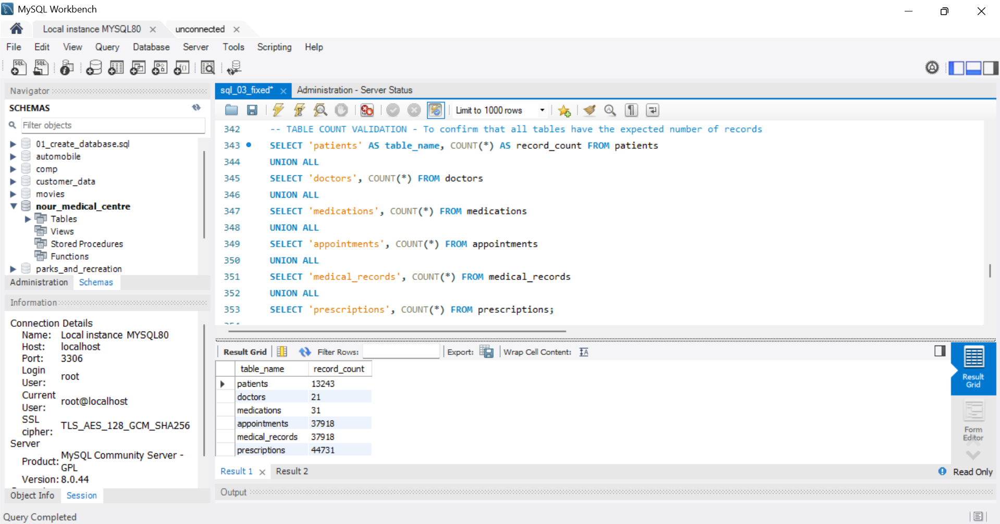

# Nour Medical Centre
## Database Design & Refinement

---

## 1. Purpose of This Document

This document provides the detailed design rationale, evaluation, and refinement process for the Nour Medical Centre relational database.

The purpose is not only to describe the final database structure, but also to demonstrate how the business requirements were translated into a relational model, how the design was evaluated against core database principles, and how identified limitations were addressed.

The design process follows:

> **Requirements Analysis → Entity Identification → Relationship Modeling → Schema Design → Evaluation → Refinement → Implementation**

The database is implemented using **MySQL** with the **InnoDB** storage engine.

---

# 2. Business Context

Nour Medical Centre is a small medical facility that requires a database to manage its day-to-day clinical operations.

The initial requirements focus on:

- Patient management
- Doctor management
- Appointment management
- Diagnosis recording
- Medication and prescription management

The database should provide a reliable and structured way to store this information while maintaining the relationships between patients, doctors, appointments, medical records, and medications.

---

# 3. Business Requirements

The database is based on the following requirements.

## 3.1 Patients

Each patient must have:

- A unique ID
- Full name
- Date of birth
- Contact number

---

## 3.2 Doctors

Each doctor must have:

- A unique ID
- Name
- Specialisation

---

## 3.3 Appointments

Patients can book appointments with specific doctors.

Each appointment must record:

- Patient
- Doctor
- Date
- Time
- Reason for visit

---

## 3.4 Medical Outcome

After an appointment, the doctor records:

- Diagnosis
- Any prescribed medication

---

## 3.5 Relationships

The requirements specify that:

- A patient can have many appointments.
- A doctor can see many patients.

The database must therefore correctly represent these relationships.

---

# 4. Requirements-to-Entity Mapping

The business requirements were translated into six core entities.

| Requirement | Entity | Purpose |
|---|---|---|
| Patient management | `Patients` | Stores patient identity and contact information |
| Doctor management | `Doctors` | Stores doctor information and specialisation |
| Appointment management | `Appointments` | Records interactions between patients and doctors |
| Clinical outcome | `Medical Records` | Stores diagnosis associated with appointments |
| Medication management | `Medications` | Stores a structured list of medications |
| Prescription management | `Prescriptions` | Links medications to appointments and stores prescription details |

This separation ensures that each table represents a distinct business concept.

---

# 5. Initial Schema Design

The initial design was based directly on the requirements.

The first version contained four core entities:

```text
Patients
Doctors
Appointments
Medical Records
````

The original `Medical Records` table contained:

```text
medical_record_id
appointment_id
diagnosis
prescribed_medication
```

At this stage, the design satisfied the stated requirements.

However, the schema was subsequently evaluated against relational database principles and scalability considerations.

---

# 6. Initial Design Evaluation

The initial schema was evaluated against the following criteria:

* Persistence
* Relational structure
* Primary keys
* Foreign keys
* Referential integrity
* Normalization
* CRUD operations
* ACID principles
* Data redundancy
* Scalability
* Queryability

The initial design satisfied most of these requirements.

However, one significant design limitation was identified:

> **Prescribed medication was stored as a single free-text attribute.**

This presented a potential problem for a relational database designed to support future operational and analytical requirements.

---

# 7. Identified Design Issue: Prescribed Medication

## 7.1 Initial Approach

The original `Medical Records` table stored medication as:

```text
prescribed_medication
```

For example:

```text
Paracetamol 500mg twice daily for 5 days;
Amoxicillin 500mg three times daily for 7 days
```

Although this satisfies the basic requirement of recording prescribed medication, it introduces several limitations.

---

## 7.2 Why the Initial Approach Was Limited

Storing medications as free text makes it difficult to:

### Query individual medications

A query such as:

> "How many times was Amoxicillin prescribed?"

would require searching text rather than querying a structured relationship.

### Support multiple medications

An appointment may involve several medications.

A single text field does not represent these medications as individual database records.

### Store medication-specific attributes

Different medications may have different:

* Dosages
* Frequencies
* Treatment durations

These should be associated with the specific medication being prescribed.

### Maintain consistency

The same medication could be entered in different formats:

```text
Paracetamol
paracetamol
PARACETAMOL
Paracetamol 500mg
```

This creates potential data-quality and reporting problems.

### Support analytical reporting

A normalized structure makes it easier to answer questions such as:

* Which medications are prescribed most frequently?
* Which doctors prescribe a particular medication?
* How many prescriptions were issued within a period?
* What medications are associated with particular diagnoses?

---

# 8. Implemented Schema Refinement

To address the limitation, the prescription structure was redesigned.

Two new entities were introduced:

```text
Medications
Prescriptions
```

The `prescribed_medication` attribute was removed from `Medical Records`.

The revised model separates:

1. The medication itself.
2. The prescription event.
3. The appointment associated with the prescription.

---

# 9. Revised Database Structure

The final database contains six tables:

```text
PATIENTS
DOCTORS
APPOINTMENTS
MEDICAL_RECORDS
MEDICATIONS
PRESCRIPTIONS
```

---

## 9.1 Patients

```text
PATIENTS
--------
patient_id          PK
full_name
date_of_birth
contact_number
```

### Purpose

Stores demographic and contact information for patients.

### Primary Key

```text
patient_id
```

---

## 9.2 Doctors

```text
DOCTORS
-------
doctor_id           PK
doctor_name
specialisation
```

### Purpose

Stores information about doctors working at the medical centre.

### Primary Key

```text
doctor_id
```

---

## 9.3 Appointments

```text
APPOINTMENTS
------------
appointment_id          PK
patient_id              FK
doctor_id               FK
appointment_datetime
reason
```

### Purpose

Records appointments between patients and doctors.

### Primary Key

```text
appointment_id
```

### Foreign Keys

```text
patient_id → patients.patient_id
doctor_id  → doctors.doctor_id
```

---

## 9.4 Medical Records

```text
MEDICAL_RECORDS
---------------
medical_record_id       PK
appointment_id          FK
diagnosis
```

### Purpose

Stores the diagnosis resulting from an appointment.

### Primary Key

```text
medical_record_id
```

### Foreign Key

```text
appointment_id → appointments.appointment_id
```

The `appointment_id` field is also `UNIQUE`, which enforces a one-to-one relationship between an appointment and its medical record in the current design.

---

## 9.5 Medications

```text
MEDICATIONS
-----------
medication_id
medication_name
```

### Purpose

Stores a structured reference list of medications.

### Primary Key

```text
medication_id
```

### Constraint

```text
UNIQUE medication_name
```

This prevents the same medication from being unnecessarily stored multiple times.

---

## 9.6 Prescriptions

```text
PRESCRIPTIONS
-------------
prescription_id
appointment_id
medication_id
dosage
frequency
duration
```

### Purpose

Represents a medication prescribed during an appointment.

### Primary Key

```text
prescription_id
```

### Foreign Keys

```text
appointment_id → appointments.appointment_id
medication_id  → medications.medication_id
```
Below is a table count validation for the tables created

---

# 10. Final Entity Relationship Model

The final relationships are:

```text
PATIENTS
   │
   │ 1:M
   ▼
APPOINTMENTS
   │
   ├────────────── 1:1 ──────────────► MEDICAL_RECORDS
   │
   │ 1:M
   ▼
PRESCRIPTIONS
   │
   │ M:1
   ▼
MEDICATIONS
```

Doctors are connected to appointments through:

```text
DOCTORS
   │
   │ 1:M
   ▼
APPOINTMENTS
```

---

# 11. Relationship Analysis

## 11.1 Patient → Appointment

### Relationship: One-to-Many (1:M)

One patient can have many appointments.

```text
PATIENT
   1
   │
   │
   M
APPOINTMENT
```

Implemented through:

```text
appointments.patient_id
        ↓
patients.patient_id
```

---

## 11.2 Doctor → Appointment

### Relationship: One-to-Many (1:M)

One doctor can conduct many appointments.

```text
DOCTOR
   1
   │
   │
   M
APPOINTMENT
```

Implemented through:

```text
appointments.doctor_id
        ↓
doctors.doctor_id
```

---

## 11.3 Appointment → Medical Record

### Relationship: One-to-One (1:1)

Each appointment has one corresponding medical record in the current design.

```text
APPOINTMENT
    1
    │
    │
    1
MEDICAL RECORD
```

This is enforced by applying a `UNIQUE` constraint to:

```text
medical_records.appointment_id
```

---

## 11.4 Appointment → Prescription

### Relationship: One-to-Many (1:M)

One appointment can result in multiple prescriptions.

```text
APPOINTMENT
    1
    │
    │
    M
PRESCRIPTION
```

This is implemented through:

```text
prescriptions.appointment_id
        ↓
appointments.appointment_id
```

---

## 11.5 Medication → Prescription

### Relationship: One-to-Many (1:M)

A medication can be prescribed in many different appointments.

```text
MEDICATION
    1
    │
    │
    M
PRESCRIPTION
```

Implemented through:

```text
prescriptions.medication_id
        ↓
medications.medication_id
```

---

# 12. Why the Revised Design Is Relational

The final design demonstrates the characteristics of a relational database because:

1. Data is organized into structured tables.
2. Each table represents a logical business entity.
3. Each table has a primary key.
4. Foreign keys establish relationships between tables.
5. Relationships are represented through key values rather than duplicated data.
6. Data can be queried across related tables using SQL JOINs.
7. Constraints can be applied to protect data integrity.
8. Many-to-many relationships are resolved using an associative entity.

The `Prescriptions` table is particularly important because it acts as an associative entity between appointments and medications.

---

# 13. Normalization Assessment

The final schema was evaluated against the first three normal forms.

---

## 13.1 First Normal Form (1NF)

The schema satisfies the principles of 1NF by:

* Using atomic attributes.
* Avoiding repeating groups.
* Avoiding lists of values stored in a single field.

The prescription refinement significantly improved compliance with this principle.

Instead of:

```text
prescribed_medication =
"Paracetamol, Amoxicillin, Vitamin C"
```

the database stores individual prescription records.

---

## 13.2 Second Normal Form (2NF)

Non-key attributes are dependent on the primary key of their respective table.

For example:

```text
patient_id → full_name, date_of_birth, contact_number

doctor_id → doctor_name, specialisation

appointment_id → patient_id, doctor_id,
                 appointment_datetime, reason

medication_id → medication_name
```

Prescription-specific attributes such as dosage, frequency, and duration belong to the `Prescriptions` entity because they describe the prescription relationship.

---

## 13.3 Third Normal Form (3NF)

The design avoids unnecessary dependencies between non-key attributes.

For example:

Doctor specialisation is stored in:

```text
DOCTORS
```

rather than:

```text
APPOINTMENTS
```

Similarly, medication names are stored in:

```text
MEDICATIONS
```

rather than repeatedly storing them in:

```text
PRESCRIPTIONS
```

This reduces redundancy and improves consistency.

---

# 14. Data Integrity

The final schema uses several constraints to maintain data quality.

## Primary Keys

Each table has a unique primary key.

| Table           | Primary Key         |
| --------------- | ------------------- |
| Patients        | `patient_id`        |
| Doctors         | `doctor_id`         |
| Appointments    | `appointment_id`    |
| Medical Records | `medical_record_id` |
| Medications     | `medication_id`     |
| Prescriptions   | `prescription_id`   |

---

## Foreign Keys

Foreign keys maintain valid relationships.

```text
appointments.patient_id
        ↓
patients.patient_id
```

```text
appointments.doctor_id
        ↓
doctors.doctor_id
```

```text
medical_records.appointment_id
        ↓
appointments.appointment_id
```

```text
prescriptions.appointment_id
        ↓
appointments.appointment_id
```

```text
prescriptions.medication_id
        ↓
medications.medication_id
```

---

## NOT NULL Constraints

Required attributes are protected using `NOT NULL`.

Examples include:

```text
patients.full_name
patients.date_of_birth
patients.contact_number

doctors.doctor_name
doctors.specialisation

appointments.patient_id
appointments.doctor_id
appointments.appointment_datetime
appointments.reason
```

---

## UNIQUE Constraints

The design uses uniqueness where appropriate.

Examples:

```text
medications.medication_name
medical_records.appointment_id
```
---

## Data Integrity Validation
Following data population, referential-integrity checks were performed across all foreign-key relationships. All five validation checks returned zero invalid records, confirming that every appointment references a valid patient and doctor, every medical record references a valid appointment, and every prescription references both a valid appointment and medication.


Below is the query used for this validation

---

# 15. Persistence

The database is implemented using MySQL and uses the InnoDB storage engine.

Data is stored persistently in database tables rather than temporary application variables or volatile in-memory structures.

This means records remain available after the database session or application process ends, subject to normal database administration, backups, and retention policies.

---

# 16. ACID Principles

The database can support ACID-compliant transactions through the MySQL InnoDB storage engine.

Consider a transaction in which an appointment and its related medical information are being recorded.

A transaction could involve:

1. Creating the appointment.
2. Creating the medical record.
3. Creating one or more prescription records.

If all operations succeed:

```sql
COMMIT;
```

If an error occurs during the process:

```sql
ROLLBACK;
```

This supports the following ACID properties.

### Atomicity

The transaction is treated as a single unit.

### Consistency

Constraints help prevent invalid relationships and invalid data states.

### Isolation

Concurrent transactions are managed according to the configured transaction isolation level.

### Durability

Committed transactions are persisted by the database engine.

Therefore, the design provides a foundation for reliable clinical transaction processing.

---

# 17. CRUD Capability

All six core tables support standard CRUD operations.

| Table           | Create | Read | Update | Delete |
| --------------- | :----: | :--: | :----: | :----: |
| Patients        |    ✓   |   ✓  |    ✓   |    ✓   |
| Doctors         |    ✓   |   ✓  |    ✓   |    ✓   |
| Appointments    |    ✓   |   ✓  |    ✓   |    ✓   |
| Medical Records |    ✓   |   ✓  |    ✓   |    ✓   |
| Medications     |    ✓   |   ✓  |    ✓   |    ✓   |
| Prescriptions   |    ✓   |   ✓  |    ✓   |    ✓   |

Examples include:

### Create

* Register a patient.
* Add a doctor.
* Book an appointment.
* Record a diagnosis.
* Add a medication.
* Create a prescription.

### Read

* Retrieve a patient's appointment history.
* Retrieve a doctor's appointments.
* View diagnoses.
* Retrieve prescriptions.
* Identify frequently prescribed medications.

### Update

* Update patient contact details.
* Update doctor information.
* Modify appointment information where appropriate.
* Update medication reference information.

### Delete

Records can technically be deleted through SQL, although clinical records in a real healthcare environment should be governed by appropriate retention, audit, and regulatory policies.

---

# 18. Business and Analytical Use Cases

The final schema supports operational and analytical questions such as:

### Patient Analysis

* How many appointments has each patient had?
* What is a patient's appointment history?
* Which doctors has a patient visited?

### Doctor Analysis

* How many appointments has each doctor handled?
* Which patients has a doctor seen?
* How are appointments distributed across specialisations?

### Appointment Analysis

* How many appointments occurred within a given period?
* Which doctor is assigned to each appointment?
* Which patients have upcoming appointments?

### Diagnosis Analysis

* What diagnoses have been recorded?
* How frequently does each diagnosis occur?

### Medication Analysis

* Which medications are prescribed most frequently?
* Which doctors prescribe specific medications?
* How many prescriptions were issued during a given period?

The normalized prescription structure makes these analytical queries significantly easier than a free-text medication field would.

---

# 19. Implemented Refinement: Prescription Management

## Problem

The initial design stored:

```text
prescribed_medication
```

as a free-text field.

This was sufficient for the basic requirement but limited the database's ability to manage multiple medications and perform structured analysis.

---

## Reason for Change

The refinement was made because:

* One appointment can involve multiple medications.
* Medication names should be stored consistently.
* Dosage can vary by prescription.
* Frequency can vary by prescription.
* Treatment duration can vary by prescription.
* Medication-level analysis may be required in the future.
* Free-text values are difficult to query reliably.

---

## Change Implemented

The following entities were introduced:

```text
MEDICATIONS
PRESCRIPTIONS
```

The following field was removed:

```text
medical_records.prescribed_medication
```

The resulting structure is:

```text
APPOINTMENTS
     │
     │ 1:M
     ▼
PRESCRIPTIONS
     │
     │ M:1
     ▼
MEDICATIONS
```

---

## Result

The refined design provides:

* Structured medication management.
* Multiple medications per appointment.
* Medication-specific dosage.
* Medication-specific frequency.
* Treatment duration.
* Reduced data redundancy.
* Improved data consistency.
* Better analytical capability.
* Greater scalability.

---

# 20. Validation Against Original Requirements

The revised schema was checked against the original business scenario.

| Requirement                        | Design Implementation           | Result      |
| ---------------------------------- | ------------------------------- | ----------- |
| Patients have unique IDs           | `patients.patient_id`           | ✓ Satisfied |
| Patient name is stored             | `patients.full_name`            | ✓ Satisfied |
| Patient date of birth is stored    | `patients.date_of_birth`        | ✓ Satisfied |
| Patient contact number is stored   | `patients.contact_number`       | ✓ Satisfied |
| Doctors have unique IDs            | `doctors.doctor_id`             | ✓ Satisfied |
| Doctor name is stored              | `doctors.doctor_name`           | ✓ Satisfied |
| Doctor specialisation is stored    | `doctors.specialisation`        | ✓ Satisfied |
| Patients can book appointments     | `appointments`                  | ✓ Satisfied |
| Appointment identifies patient     | `appointments.patient_id`       | ✓ Satisfied |
| Appointment identifies doctor      | `appointments.doctor_id`        | ✓ Satisfied |
| Appointment date/time is recorded  | `appointment_datetime`          | ✓ Satisfied |
| Reason for visit is recorded       | `reason`                        | ✓ Satisfied |
| Diagnosis is recorded              | `medical_records.diagnosis`     | ✓ Satisfied |
| Medication can be recorded         | `prescriptions` + `medications` | ✓ Satisfied |
| Patient can have many appointments | Patient 1:M Appointment         | ✓ Satisfied |
| Doctor can see many patients       | Doctor 1:M Appointment          | ✓ Satisfied |

The refinement therefore changes the internal representation of medication data without breaking any of the relationships specified in the original scenario.

---

# 21. Design Decision: Requirements-Driven Scope

An important principle applied throughout the project was **requirements-driven database design**.

It would be possible to introduce many additional entities, such as:

* Payments
* Insurance
* Laboratory services
* Nurses
* Departments
* Staff
* Patient addresses
* Emergency contacts
* Medical procedures

However, introducing entities that are not supported by the current business requirements could unnecessarily increase complexity.

Therefore, the final design focuses on the six entities required to provide a robust solution to the current scenario:

```text
Patients
Doctors
Appointments
Medical Records
Medications
Prescriptions
```

Future requirements can drive subsequent schema evolution.

---

# 22. Future Refinements

Although the current design satisfies the stated requirements, additional enhancements could be introduced if the medical centre's operational needs expand.

---

## 22.1 Appointment Status

### Current Limitation

The `Appointments` table does not indicate the current status of an appointment.

### Proposed Change

Add:

```text
appointment_status
```

Possible values:

```text
Scheduled
Completed
Cancelled
No-show
```

### Reason

This would allow the medical centre to distinguish between different appointment outcomes.

### Expected Result

The database could support analysis such as:

* Appointment completion rate.
* Cancellation rate.
* No-show rate.
* Doctor appointment utilization.

### Classification

**Future Enhancement**

---

# 23. Future Refinement: Audit Timestamps

### Current Limitation

The database does not currently record when records were created or modified.

### Proposed Change

Add:

```text
created_at
updated_at
```

### Reason

Audit timestamps improve:

* Traceability
* Data governance
* Troubleshooting
* Change monitoring

### Expected Result

The database would be able to identify:

* When a record was created.
* When it was last updated.
* Which records have recently changed.

### Classification

**Future Enhancement**

---

# 24. Future Refinement: Payment Management

### Current Limitation

The database does not currently manage financial transactions.

### Proposed Change

Introduce a `Payments` table:

```text
PAYMENTS
--------
payment_id
appointment_id
amount
payment_date
payment_method
payment_status
```

### Reason

A medical centre may eventually need to connect clinical services with billing and payment information.

### Expected Result

The database could support:

* Payment tracking.
* Outstanding balances.
* Revenue reporting.
* Payment method analysis.

### Classification

**Future Enhancement**

---

# 25. Future Refinement: Laboratory Management

### Current Limitation

The current database does not support laboratory tests or results.

### Proposed Change

Potential entities include:

```text
LAB_TESTS
---------
test_id
test_name

LAB_ORDERS
----------
lab_order_id
appointment_id
test_id
test_date
result
status
```

### Reason

A medical centre may eventually need to manage diagnostic tests associated with patient appointments.

### Expected Result

The database could support:

* Test ordering.
* Test results.
* Test history.
* Patient laboratory reporting.

### Classification

**Future Enhancement**

---

# 26. Future Refinement: Staff and Department Management

### Current Limitation

The current design focuses on doctors as the primary clinical professionals.

It does not model other staff members or organizational departments.

### Proposed Change

Future entities could include:

```text
STAFF
DEPARTMENTS
ROLES
```

### Reason

As the medical centre grows, managing staff responsibilities and departmental structures may become necessary.

### Expected Result

The database could support:

* Staff management.
* Department assignments.
* Role-based organizational reporting.
* Staff workload analysis.

### Classification

**Future Enhancement**

---

# 27. Refinement Summary

| Refinement               | Reason                                               | Structural Change                     | Expected Result                        | Status          |
| ------------------------ | ---------------------------------------------------- | ------------------------------------- | -------------------------------------- | --------------- |
| Structured prescriptions | Free-text medication limits scalability and analysis | Add `Medications` and `Prescriptions` | Structured prescription management     | **Implemented** |
| Appointment status       | No appointment lifecycle information                 | Add `appointment_status`              | Better operational reporting           | Future          |
| Audit timestamps         | No record-change tracking                            | Add `created_at`, `updated_at`        | Better traceability                    | Future          |
| Payment management       | No financial tracking                                | Add `Payments`                        | Billing and revenue analysis           | Future          |
| Laboratory management    | No test/result management                            | Add laboratory entities               | Broader clinical workflow support      | Future          |
| Staff/departments        | No organizational staff structure                    | Add staff-related entities            | Workforce and organizational reporting | Future          |

---

# 28. Final Design Assessment

The final schema satisfies the original business requirements while providing a more structured and scalable approach to medication management.

The database:

* Stores data persistently.
* Uses a relational database structure.
* Contains a primary key for every table.
* Uses foreign keys to establish relationships.
* Correctly represents patient-doctor relationships through appointments.
* Supports multiple appointments per patient.
* Supports multiple appointments per doctor.
* Supports diagnosis recording.
* Supports multiple medications per appointment.
* Supports structured prescription information.
* Supports CRUD operations.
* Applies normalization principles.
* Maintains referential integrity.
* Supports transactional processing through InnoDB.
* Provides a foundation for future expansion.

---

# 29. Key Design Insight

The most important refinement in this project demonstrates a broader database design principle:

> **A database should not only satisfy today's requirements; it should represent business information in a structure that remains useful as those requirements evolve.**

The initial free-text medication field technically satisfied the requirement.

However, evaluation revealed that it would limit the database's ability to manage multiple medications and perform medication-level analysis.

The schema was therefore refined to introduce:

```text
MEDICATIONS
     ▲
     │
     │
PRESCRIPTIONS
     ▲
     │
     │
APPOINTMENTS
```

This preserved the original business relationships while improving:

* Normalization
* Data integrity
* Queryability
* Scalability
* Analytical capability

---

# 30. Conclusion

The Nour Medical Centre database demonstrates a requirements-driven approach to relational database design.

The project progressed beyond simply creating tables by evaluating the schema against core database principles and identifying areas where the initial design could be improved.

The prescription management refinement demonstrates this process:

> **Identify requirement → Design schema → Evaluate limitation → Refine structure → Validate against requirements**

The final database provides a practical foundation for managing patients, doctors, appointments, diagnoses, medications, and prescriptions while leaving a clear path for future expansion.

The key design principle is therefore:

> **Build for the current requirements, evaluate against sound database principles, refine where necessary, and design with future scalability in mind.**
